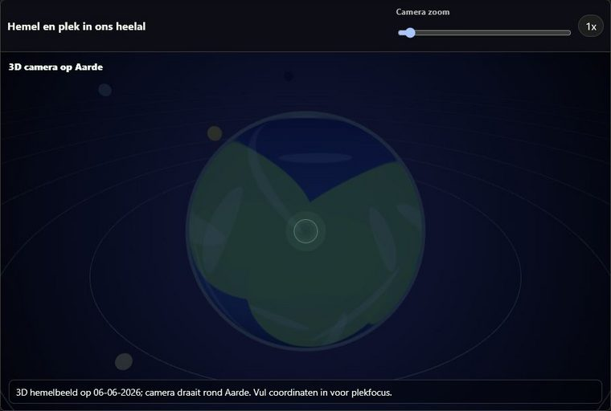

# Veritas Rerum

Publieke documentatie en screenshots voor **Andere/Huidige Realiteit**, een interactieve module op:

https://www.veritasrerum.com

Deze repository deelt **geen WordPress-pluginbroncode** en bevat geen lokale databundels. De repo is bedoeld om uit te leggen wat de module doet, welke onderdelen erin zitten, hoe de ervaring is opgebouwd en hoe bezoekers de live versie kunnen vinden.

## Andere/Huidige Realiteit

Andere/Huidige Realiteit is een browserervaring die ingevulde gegevens zoals naam, datum en optionele locatie omzet in meerdere symbolische perspectieven. De module combineert datumgetal, dag van het jaar, astrologische indicaties, numerologie, symboliek, historische datumgebeurtenissen en een 3D-hemelweergave.

## Belangrijkste Onderdelen

- **Naam- en datumvelden**: invoer voor volledige naam, dag, maand en jaar.
- **Optionele locatievelden**: latitude, longitude, altitude en beschrijvende locatievelden.
- **Datumgetal en dagpositie**: snelle numerieke interpretaties van de gekozen datum.
- **Astrologie en maanstand**: weergave van teken, element, planeet en maanfase.
- **3D-hemelcamera**: visuele ruimtelijke weergave rond de gekozen datum en plek.
- **Historische gebeurtenissen**: offline datumgeschiedenis per dag.
- **Zodiac en Chinese zodiac**: aanvullende symbolische lagen.
- **Naam- en woordanalyse**: numerologische verwerking van letters en woorden.
- **Tarot/symboliekkaarten**: visuele symboliek als reflectielaag.
- **Print/PDF**: mogelijkheid om de huidige weergave af te drukken.

Meer detail staat in [docs/onderdelen.md](docs/onderdelen.md).

## Screenshots

### Ingevulde Desktopweergave

### 3D-Weergave

## Privacy En Offline Opzet

De oorspronkelijke module is ontworpen met lokale verwerking als uitgangspunt. Appdata zoals datumgeschiedenis en symboliek kunnen lokaal vanuit browserbestanden worden gebruikt. De WordPress-variant toont de module als frontendervaring op de website.

Zie [docs/privacy-en-offline.md](docs/privacy-en-offline.md).

## Website

Live website:

https://www.veritasrerum.com

## Wat Deze Repo Niet Bevat

- Geen WordPress-pluginbestanden.
- Geen PHP-broncode.
- Geen volledige offline databundels.
- Geen distributie-zip of installatiepakket.

Deze repo is alleen bedoeld voor publieke uitleg, documentatie en visuele presentatie.
